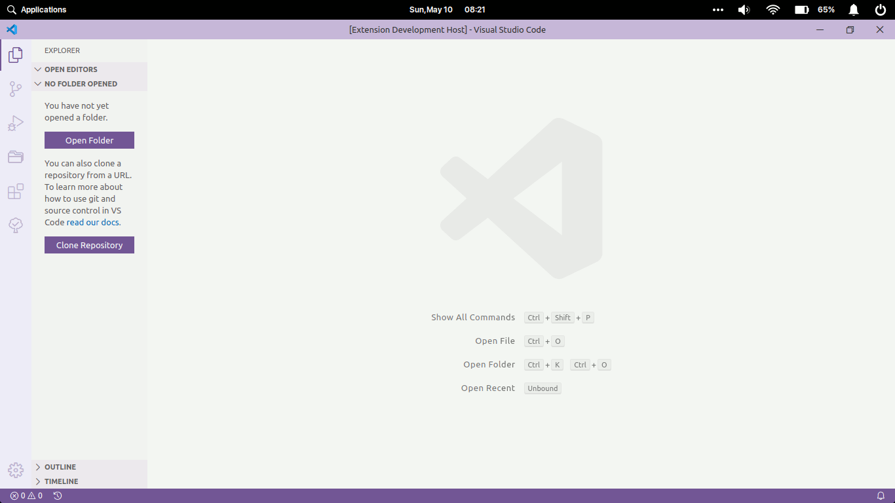
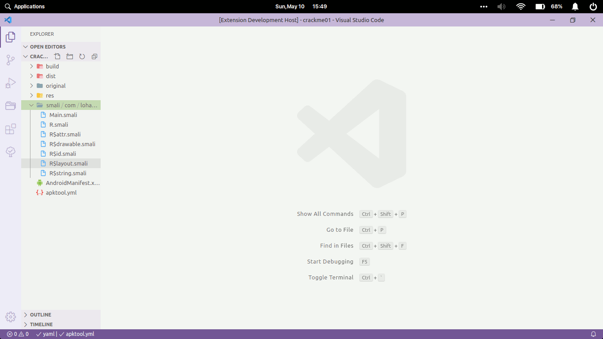

# APK Lab

APK Lab extension provides an automated and easy-to-use workflow for reverse engineering of Android apps (APK) by integrating popular CLI tools such as `Apktool` with the excellent VS Code so you can spend more time on app analysis not tooling.

## Features

1. DeAssemble/Decode an APK file using [**`Apktool`**](https://github.com/ibotpeaches/apktool/)

    

2. Rebuild APK file using **`Apktool`** (Right click in `apktool.yml` file)
3. Sign the rebuilt APK using [**`uber-apk-signer`**](https://github.com/patrickfav/uber-apk-signer)

    

## Requirements

1. **JDK 8** or higher should be in your PATH
2. **Apktool**: Download the latest [`apktool.jar`](https://github.com/ibotpeaches/apktool/releases/) and update its location in VS Code settings under (**`Apklab: Apktool Path`**)
3. **uber-apk-signer**: Download the latest [`uber-apk-signer.jar`](https://github.com/patrickfav/uber-apk-signer/releases/) and update its location in VS Code settings under (**`Apklab: Apk Signer Path`**)

> [**Smalise**](https://marketplace.visualstudio.com/items?itemName=LoyieKing.smalise) extension is highly recommended as it makes working with `smali` files a breeze.

## Extension Settings

This extension contributes the following settings:

* **`apklab.javaPath`**: Path of `java` executable. Please update this if JDK is not in the PATH. For example:

  ```json
    {
        "apklab.javaPath": "/usr/bin/java"
    }
  ```

* **`apklab.apktoolPath`**: Path of `apktool.jar`. Please update this with absolute location(full path). For example:

  ```json
    {
        "apklab.apktoolPath": "/home/oozer/downloads/apktool_2.4.1.jar"
    }
  ```

* **`apklab.apkSignerPath`**: Path of `uber-apk-signer.jar`. Please update this with absolute(full) path. For example:

  ```json
    {
        "apklab.apkSignerPath": "/home/oozer/downloads/uber-apk-signer-1.1.0.jar"
    }
  ```

## Known Issues

## Contribution Guide

This extension is in early development stage so if you face any error or have feature-request etc., please open an issue [here](https://github.com/Surendrajat/APKLab/issues). PRs are also very welcome(We definitely need a good logo).

## Release Notes

### 0.5.0

* add: Improved error checking at each step
* add: Show useful notifications after each action
* fix: `Open an APK` closes/replaces current workspace
* fix: No logs being shown Output Channel

### 0.3.1

* fix: `Rebuild the APK` always visible in commandPalette

### 0.3.0

* Initial release
* add: DeAssemble/Decode APK file using **`Apktool`**
* add: Rebuild APK file (Context menu in `apktool.yml` file)
* add: Sign the rebuilt APK using **`uber-apk-signer`**
