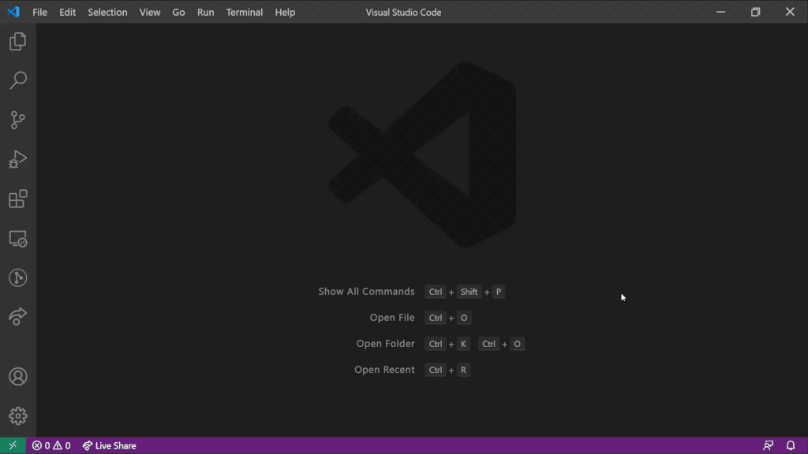

# APK Lab

[](https://marketplace.visualstudio.com/items?itemName=Surendrajat.apklab) [](https://marketplace.visualstudio.com/items?itemName=Surendrajat.apklab) [](https://github.com/Surendrajat/APKLab/actions?query=workflow%3AAPKLab)

APK Lab extension provides an automated and easy-to-use workflow for reverse engineering of Android apps (APK) by integrating popular CLI tools such as `Apktool` with the excellent VS Code so you can spend more time on app analysis not tooling.

It is NOT intended for piracy and other non-legal uses. It could be used for malware analysis, localizing, adding some features or support for custom platforms and other GOOD purposes.

## Features

- DeAssemble/Decode an APK file using [**`Apktool`**](https://github.com/ibotpeaches/apktool/)
  >Open command palette & <kbd>APKLab: Open an APK</kbd>

    

- Rebuild APK file using **`Apktool`**
  >Right click on/in `apktool.yml` file & <kbd>APKLab: Rebuild the APK</kbd>
- Sign the rebuilt APK using [**`uber-apk-signer`**](https://github.com/patrickfav/uber-apk-signer)

    

- Install APK file to device using **adb**
  >Right click on an apk file (in `dist` directory after rebuild) & <kbd>APKLab: Install the APK</kbd>

## Requirements

- **JDK 8+** should be in your **PATH**
  >Confirm it by running **`java`** in your Shell, if not found download JDK from [here](https://adoptopenjdk.net/).
- **adb** should be in your **PATH** (optional)
  >Confirm it by running **`adb devices`** in your Shell, if not found check [this guide](https://www.xda-developers.com/install-adb-windows-macos-linux/).

> [**Smalise**](https://marketplace.visualstudio.com/items?itemName=LoyieKing.smalise) extension is highly recommended as it makes working with `smali` files a breeze.

## Extension Settings

This extension contributes the following settings:

- **`apklab.apktoolPath`**: Absolute(full) Path of `apktool.jar`. Update this, if needed, like:

  ```json
    {
        "apklab.apktoolPath": "/home/oozer/downloads/apktool_2.4.1.jar"
    }
  ```

- **`apklab.apkSignerPath`**: Absolute(full) Path of `uber-apk-signer.jar`. Update this, if needed, like:

  ```json
    {
        "apklab.apkSignerPath": "/home/oozer/downloads/uber-apk-signer-1.1.0.jar"
    }
  ```

## Known Issues

## Contribution Guide

This extension is in early development stage so if you face any error or have feature-request etc., please open an issue [here](https://github.com/Surendrajat/APKLab/issues). PRs are also very welcome.

## Release Notes

### 0.7.0

- add: Install APK file to device using ADB
- add: Overwrite unsigned APK on reSigning
- nuke: `javaPath` removed from settings (Windows path issue)

### 0.6.1

- add: A cool project logo (thanks [@Feimaomii](https://github.com/Feimaomii))
- add: Some nice badges in README.md
- fix: Don't check for dependencies at multiple places

### 0.6.0

- add: Download and manage the dependencies automatically
- fix: use `java` path from config if defined

### 0.5.0

- add: Improved error checking at each step
- add: Show useful notifications after each action
- fix: `Open an APK` closes/replaces current workspace
- fix: No logs being shown Output Channel

### 0.3.1

- fix: `Rebuild the APK` always visible in commandPalette

### 0.3.0

- Initial release
- add: DeAssemble/Decode APK file using **`Apktool`**
- add: Rebuild APK file (Context menu in `apktool.yml` file)
- add: Sign the rebuilt APK using **`uber-apk-signer`**
